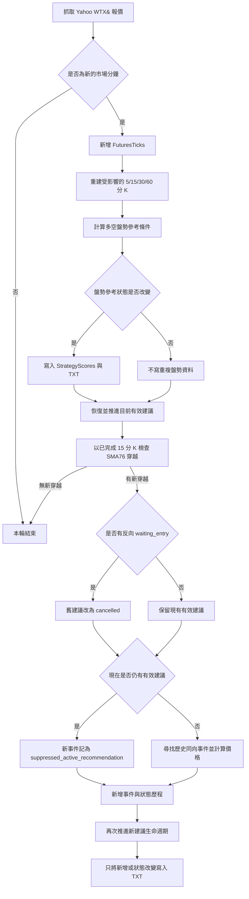

# FutureBot 目前策略計算與實作說明

## 1. 文件定位

- 文件狀態：目前程式實際行為。
- 最後核對日期：2026-07-31。
- 適用專案：`FuturesBot`、`FuturesMonitor`。
- 本文件用來協助後續除錯、調參、回測與重構。
- 如果本文件與需求規格不同：
  - 本文件代表程式目前會怎麼執行。
  - 需求規格代表產品規則原意。
  - 修改程式前應先確認要維持目前行為，還是改回需求規格。

## 2. 策略摘要

目前自動建議只由一個條件觸發：

```text
已完成 15 分 K 的 Close 突破或跌破該根 SMA76
```

- 向上突破產生 `long` 事件。
- 向下跌破產生 `short` 事件。
- 事件型態目前固定為 `reversal`。
- 舊有多空各 6 個策略條件仍每分鐘計算，但只供人類判讀盤勢。
- 6 個條件的符合數不會觸發、阻止、取消或修改自動建議。
- 找到合格的舊事件時，使用該事件觸發後的 5 分 K 計算入場區間、停損與停利。
- 找不到舊事件時仍保存本次觸發，但不報價格。
- 同一商品同一時間最多一筆 `waiting_entry` 或 `entered` 建議。
- 建議價格一旦建立便凍結，之後只更新生命週期狀態。

## 3. 每分鐘主流程

Bot 預設在每個完整分鐘之後執行一次。實際秒數由 `FetchDelaySeconds` 控制。



實際執行順序很重要：

1. 先寫入本分鐘 tick 與受影響 K 棒。
2. 計算並保存有變化的盤勢參考狀態。
3. 先推進資料庫中既有的有效建議。
4. 再判斷最新完成 15 分 K 是否形成新觸發。
5. 若新觸發與尚未入場的舊建議反向，先取消舊建議。
6. 再決定新事件要報價或只保留觸發紀錄。
7. 新建議建立後，再立即用目前已保存的 tick 推進一次狀態。

## 4. 市場資料與 K 棒來源

### 4.1 即時資料的實際精度

- 報價來源：Yahoo `WTX&`。
- Bot 每分鐘最多保存一筆相同來源市場分鐘的報價。
- `FuturesTicks` 的資料是分鐘取樣報價，不是交易所逐筆 tick。
- 5、15、30、60 分 K 都由這些分鐘取樣資料聚合。
- 因此 K 棒 OHLC 代表 Bot 看見的分鐘樣本，不一定包含交易所該區間內的真正最高價或最低價。

### 4.2 K 棒保存

資料表 `dbo.FuturesKBars` 只保存以下週期：

```text
5, 15, 30, 60 分鐘
```

- 1 分 K 由記憶體中的 `FuturesTicks` 即時計算，不寫入 `FuturesKBars`。
- 每次收到新分鐘資料，只重算並 Upsert 該分鐘影響到的 K 棒。
- SQL `MERGE` 只有在 OHLC、來源數量、結束時間或更新時間真的不同時才更新。
- 已完成且內容未改變的歷史 K 棒不應持續改動 `ModifiedAtUtc`。

### 4.3 已完成 K 棒定義

策略計算使用：

```text
BarEnd <= SampleTime
```

其中 `SampleTime` 優先採 Yahoo 回傳的市場時間，並截斷到整分鐘。

## 5. 人類盤勢參考條件

盤勢參考由 `EntryStrategyEvaluator` 計算，多方與空方各 6 個條件。

### 5.1 參數

| 參數 | 目前值 |
| --- | ---: |
| 快均線 | SMA20 |
| 慢均線 | SMA76 |
| 趨勢回看 | 5 根 15 分 K |
| 盤整近期觀察 | 8 根 15 分 K（2 小時） |
| 盤整比較基準 | 前 32 根 15 分 K（8 小時） |
| 進入盤整壓縮比門檻 | 0.60 |
| 進入盤整方向效率門檻 | 0.35 |
| 進入盤整連續確認 | 2 根 15 分 K |
| 退出盤整壓縮比門檻 | 0.80 |
| 1 分 K 均線 | SMA60 |

### 5.2 多方條件

1. 前一根 Close 在 SMA76 下方，最新 Close 在 SMA76 上方。
2. 最新 SMA76 大於 5 根前 SMA76。
3. 最新 SMA20 大於 5 根前 SMA20。
4. SMA20 大於 SMA76。
5. 目前不屬於盤整。
6. 最新 1 分 K Close 大於 1 分 K SMA60。

### 5.3 空方條件

1. 前一根 Close 在 SMA76 上方，最新 Close 在 SMA76 下方。
2. 最新 SMA76 小於 5 根前 SMA76。
3. 最新 SMA20 小於 5 根前 SMA20。
4. SMA20 小於 SMA76。
5. 目前不屬於盤整。
6. 最新 1 分 K Close 小於 1 分 K SMA60。

### 5.4 盤整判斷

盤整判斷不使用 SMA76。每次只使用已完成的 15 分 K，將最近 8 根視為近期兩小時區間，並將它前面的 32 根切成 4 個互不重疊的兩小時區段。

```text
RecentRange =
    最近 8 根的最高 High - 最低 Low

BaselineRanges =
    前 32 根依時間切成 4 組，每組 8 根各自計算最高 High - 最低 Low

BaselineMedianRange =
    4 組 BaselineRanges 的中位數

RangeCompressionRatio =
    RecentRange / BaselineMedianRange

DirectionPath =
    |第一根 Close - 第一根 Open|
    + 後續每根 |本根 Close - 前一根 Close| 的總和

DirectionEfficiency =
    |最後一根 Close - 第一根 Open| / DirectionPath

EntrySignal =
    RangeCompressionRatio <= 0.60
    且 DirectionEfficiency <= 0.35

IsConsolidating =
    EntrySignal 連續 2 根成立後為 true
```

`RangeCompressionRatio` 用來確認最近兩小時的總區間是否相對前 8 小時明顯縮小；`DirectionEfficiency` 用來排除區間雖小、但價格持續單向緩漲或緩跌的行情。完全沒有價格移動時，方向效率定義為 `0`。

進入盤整後使用不同的退出門檻，避免狀態在臨界值附近反覆切換。符合任一條件即退出盤整：

1. `RangeCompressionRatio >= 0.80`。
2. 最新收盤價高於或低於前 8 根 15 分 K 的完整 High/Low 區間。

若前 4 個兩小時區段的中位區間為 `0`，且近期區間也為 `0`，壓縮比定義為 `0`；若基準為 `0` 但近期已有波動，壓縮比不計算，不能觸發進入盤整，盤整中則視為區間擴張並退出。

### 5.5 1 分 K SMA60 補值

Yahoo 不一定每分鐘都有新報價，因此 1 分 K SMA60 會把缺漏分鐘以前一個可用 Close 向前補值，再計算連續 60 分鐘平均。

### 5.6 資料充足門檻

- 盤整指標需要最近 8 根加前 32 根，至少 40 根已完成 15 分 K；盤整成立另需下一根連續確認，因此最早會在第 41 根成立。
- SMA76 加 5 根趨勢回看仍需要至少 81 根已完成 15 分 K，所以使用預設參數時，完整盤勢參考仍以 81 根為門檻。
- 還需要可補足連續 60 分鐘的 1 分 K 資料。
- 資料不足時仍會回傳多空狀態，但 `Status` 會是：
  - `no_completed_15m_bar`
  - `insufficient_sma_data`
  - `insufficient_1m_sma_data`
  - `insufficient_consolidation_data`

### 5.7 保存時機

盤勢參考每分鐘計算，但只在以下狀態鍵改變時新增 `StrategyScores` 與 TXT：

```text
Side
MatchedCount
TotalCount
Status
ConsolidationState
ConsolidationMetricVersion
MatchedConditions
MissingConditions
```

`ConsolidationMetricVersion` 目前為 `range_v2`；它確保從舊版 SMA76 盤整算法升級後，即使盤整布林狀態相同，也會寫入第一筆新版結果。`BarEnd`、評估時間、盤整壓縮比與方向效率等數字本身不在狀態鍵中。

## 6. 自動建議觸發

### 6.1 必要資料量

- 只取已完成的 15 分 K。
- 前一根與最新一根都必須已算出 SMA76。
- 實際至少需要 77 根已完成 15 分 K，才能同時比較前一根與最新一根的 SMA76。
- SMA20 可以為空，不會阻止觸發。
- 其他盤勢參考資料不足也不會阻止觸發。

### 6.2 多方觸發

```text
PreviousClose <= PreviousSma76
且
TriggerClose > TriggerSma76
```

- `Side = long`
- `EventType = reversal`
- `TriggerRule = 15m_close_cross_above_sma76`

### 6.3 空方觸發

```text
PreviousClose >= PreviousSma76
且
TriggerClose < TriggerSma76
```

- `Side = short`
- `EventType = reversal`
- `TriggerRule = 15m_close_cross_below_sma76`

### 6.4 去重

事件唯一鍵為：

```text
Symbol + TriggerBarStartTaipei + Side + EventType
```

同一根觸發棒在接下來每分鐘被重複檢查時，不會重複新增事件。

## 7. 目前 5 分 K ATR14

ATR 使用已完成的 5 分 K：

```text
TR =
    Max(
        High - Low,
        Abs(High - PreviousClose),
        Abs(Low - PreviousClose)
    )

ATR14 =
    最近 14 個 TR 的算術平均
```

- 計算 14 個 TR 需要至少 15 根已完成 5 分 K。
- ATR 必須大於 0。
- ATR 資料不足時仍新增 SMA76 觸發事件。
- 此時狀態為 `insufficient_price_data`，價格欄位皆為空值。
- 同一觸發棒的事件已建立後，不會因下一分鐘 ATR 變完整而重新報價。

## 8. 歷史參考事件選擇

### 8.1 搜尋範圍

- 每次最多讀取最新 500 筆 `EntryRecommendationEvents`。
- 由最新往最舊逐筆檢查。
- 候選事件必須：
  - 與目前事件方向相同。
  - `EventType` 相同，目前皆為 `reversal`。
  - 早於目前觸發時間。
  - 候選事件的 `TriggerAtr5 > 0`。
  - ATR 比率介於 `0.5` 至 `2.0`。

```text
AtrRatio =
    CurrentTriggerAtr5 / ReferenceTriggerAtr5
```

- 日盤與夜盤不分開搜尋，也不加權。
- SMA20、均線方向、均線排列、盤整、1 分 SMA60 與 6 條件分數都不參與篩選。

### 8.2 一個容易誤解的重要實作

目前價格不是把多筆同向事件合併統計，而是：

1. 從最近一筆同向事件開始。
2. 只使用該事件本身的 5 分 K 分布建立價格模型。
3. 如果該事件資料或映射價格不合格，再嘗試更舊的一筆。
4. 第一筆成功產生有效價格結構的事件即成為 `ReferenceEventId`。

因此 P25、P50、P90、P60 的樣本是單一參考事件中的 5 分 K 棒，不是多個歷史事件。

### 8.3 目前對候選事件狀態的限制

程式沒有要求參考事件本身必須是 `take_profit`、`stop_loss` 或曾經報價。

只要舊事件：

- 是真實保存的同向 SMA76 觸發事件。
- 有有效的觸發 ATR。
- 觸發後存在足夠的 5 分 K 路徑。

就可能被重新建模使用。因此 `no_reference_event`、`invalid_price_structure` 或 `suppressed_active_recommendation` 等舊觸發紀錄，未來仍可能成為價格參考。`insufficient_price_data` 因為沒有有效 `TriggerAtr5`，不符合候選條件。

## 9. 參考事件區段

### 9.1 區段起訖

參考事件的 5 分 K 必須符合：

```text
BarStart >= ReferenceTriggerBarEnd
且
BarEnd <= EventEnd
```

`EventEnd` 取以下最早時間：

1. 參考事件所屬交易時段收盤。
2. 目前新事件觸發時間。
3. 參考事件之後第一筆反方向觸發事件時間。

目前不使用參考事件資料列本身的 `CompletedAtTaipei` 截斷歷史價格路徑。

### 9.2 等待與追蹤窗口

| 用途 | 目前根數 | 等同時間 |
| --- | ---: | ---: |
| 等待入場分布 | 最多 12 根 5 分 K | 60 分鐘 |
| 最少有效等待資料 | 6 根 5 分 K | 30 分鐘 |
| 入場後價格分布 | 最多 24 根 5 分 K | 120 分鐘 |

## 10. 入場區間計算

定義方向符號：

```text
SideSign =
    long  => +1
    short => -1
```

每根等待區段 5 分 K 使用對進場較有利的一側：

```text
FavorablePrice =
    long  => Low
    short => High
```

標準化距離：

```text
HistoricalZ =
    SideSign
    × (FavorablePrice - ReferenceSma76)
    / ReferenceAtr5
```

在同一參考事件最多 12 個 `HistoricalZ` 中，以線性插值計算 P25 與 P50：

```text
Position = (SampleCount - 1) × Percentile
```

若 Position 不是整數，使用上下兩筆排序值做線性插值。

先還原參考事件自己的入場區間：

```text
ReferenceEntryA =
    ReferenceSma76 + SideSign × P25(HistoricalZ) × ReferenceAtr5

ReferenceEntryB =
    ReferenceSma76 + SideSign × P50(HistoricalZ) × ReferenceAtr5

ReferenceEntryLow  = Min(ReferenceEntryA, ReferenceEntryB)
ReferenceEntryHigh = Max(ReferenceEntryA, ReferenceEntryB)
ReferenceEntryMid  = (ReferenceEntryLow + ReferenceEntryHigh) / 2
```

等待區段內第一根符合以下條件的 5 分 K 視為參考事件進場：

```text
Bar.Low <= ReferenceEntryHigh
且
Bar.High >= ReferenceEntryLow
```

找不到觸價棒時，該候選參考事件無效，繼續尋找更舊事件。

## 11. 停損與停利分布

從參考事件的觸價棒開始，最多取 24 根 5 分 K。

每根 K 棒的不利距離：

```text
Adverse =
    long  => Max(0, ReferenceEntryMid - Low) / ReferenceAtr5
    short => Max(0, High - ReferenceEntryMid) / ReferenceAtr5
```

每根 K 棒的有利距離：

```text
Favorable =
    long  => Max(0, High - ReferenceEntryMid) / ReferenceAtr5
    short => Max(0, ReferenceEntryMid - Low) / ReferenceAtr5
```

目前程式計算：

```text
StopFactor       = P90(每根 K 棒的 Adverse)
TakeProfitFactor = P60(每根 K 棒的 Favorable)
```

兩個因子都必須大於 0。

注意：目前是對追蹤區段內「每根 K 棒的 excursion」取百分位，不是先把整個事件濃縮成單一最大 MAE、最大 MFE 後，再跨多個事件計算百分位。

## 12. 映射目前建議價格

將參考事件標準化結果映射到目前觸發時的 SMA76 與 ATR14：

```text
MappedEntryA =
    CurrentSma76 + SideSign × P25(HistoricalZ) × CurrentAtr5

MappedEntryB =
    CurrentSma76 + SideSign × P50(HistoricalZ) × CurrentAtr5

EntryLow  = Min(Round(MappedEntryA), Round(MappedEntryB))
EntryHigh = Max(Round(MappedEntryA), Round(MappedEntryB))
EntryMid  = (EntryLow + EntryHigh) / 2

StopLoss =
    Round(EntryMid - SideSign × StopFactor × CurrentAtr5)

TakeProfit =
    Round(EntryMid + SideSign × TakeProfitFactor × CurrentAtr5)
```

目前所有報價都四捨五入到整數點，並使用：

```text
MidpointRounding.AwayFromZero
```

目前未另外套用商品可設定的 TickSize。

報酬風險比：

```text
RiskPoints   = Abs(EntryMid - StopLoss)
RewardPoints = Abs(TakeProfit - EntryMid)

RewardRiskRatio =
    RewardPoints / RiskPoints
```

有效價格結構：

```text
RewardRiskRatio >= 1.5
```

多方：

```text
StopLoss < EntryLow <= EntryHigh < TakeProfit
```

空方：

```text
TakeProfit < EntryLow <= EntryHigh < StopLoss
```

若某候選事件能建立歷史模型，但映射後結構無效，會繼續尋找更舊事件。

- 所有候選都無法建立歷史模型：`no_reference_event`。
- 至少一筆能建立模型，但全部映射無效：`invalid_price_structure`。
- 找到有效模型：`waiting_entry`。

## 13. 單一有效建議

有效狀態只有：

```text
waiting_entry
entered
```

資料庫有 Filtered Unique Index：

```text
每個 Symbol 最多一筆 IsActive = 1
```

新觸發發生時：

- 舊建議是反方向 `waiting_entry`：
  - 舊建議先改為 `cancelled`。
  - 新事件接著嘗試建立價格。
- 舊建議是 `entered`：
  - 不會被反方向觸發取消。
  - 新觸發仍保存，但狀態為 `suppressed_active_recommendation`，且不報價格。
- 仍存在其他有效建議：
  - 新觸發只保存稽核事件。
  - 不建立第二筆有效建議。

## 14. 建議生命週期

### 14.1 等待入場

對 `waiting_entry`：

1. 讀取 `TriggerAt` 到目前 `SampleTime` 的所有已保存 tick。
2. 依 `CapturedAt` 由早到晚排序。
3. 第一筆符合以下條件的 tick 觸發入場：

```text
EntryLow <= TickPrice <= EntryHigh
```

4. 狀態改為 `entered`。
5. 保存該 tick 的 `CapturedAt` 與 `Price` 為 `EnteredAtTaipei`、`EntryPrice`。

未入場時，符合任一條件便改為 `expired`：

- 自觸發後已完成 12 根 5 分 K。
- 已到觸發事件所屬交易時段收盤。

### 14.2 入場後出場

多方：

```text
TickPrice <= StopLoss   => stop_loss
TickPrice >= TakeProfit => take_profit
```

空方：

```text
TickPrice >= StopLoss   => stop_loss
TickPrice <= TakeProfit => take_profit
```

- tick 依時間由早到晚掃描。
- 對同一筆 tick，程式先檢查停損，再檢查停利。
- 每筆 tick 只有一個價格，正常情況不會同時符合兩邊。
- 入場後完成 24 根 5 分 K，或到該交易時段收盤仍未出場時，狀態改為 `timed_out`。
- 5 分 K 計數包含 `BarEnd > start && BarEnd <= SampleTime` 的 K 棒，因此入場所在的部分 5 分 K 可能被算作第一根。

### 14.3 重啟恢復

- Bot 啟動時會從 SQL 載入既有 `FuturesTicks`。
- 每分鐘先載入目前有效建議，再以歷史 tick 重新掃描狀態。
- 若停機期間保存的資料足以形成多個轉換，同一輪可能依序完成：

```text
waiting_entry -> entered -> take_profit/stop_loss
```

每個轉換都會獨立寫入狀態歷程。

## 15. 狀態清單

| Status | IsActive | 意義 |
| --- | --- | --- |
| `triggered_no_price` | 否 | 已定義但目前正常建立流程不會先停在此狀態 |
| `insufficient_price_data` | 否 | 觸發成立，但 ATR14 不足 |
| `no_reference_event` | 否 | 沒有可建立價格的歷史同向事件 |
| `invalid_price_structure` | 否 | 有歷史模型，但價格順序或 R/R 不合格 |
| `waiting_entry` | 是 | 已報價，等待 tick 進入區間 |
| `entered` | 是 | 已進入建議區間，等待結果 |
| `take_profit` | 否 | 入場後先碰到停利 |
| `stop_loss` | 否 | 入場後先碰到停損 |
| `expired` | 否 | 等待入場超過 12 根 5 分 K 或收盤 |
| `timed_out` | 否 | 入場後超過 24 根 5 分 K 或收盤 |
| `cancelled` | 否 | 入場前發生反方向 SMA76 穿越 |
| `suppressed_active_recommendation` | 否 | 已有有效建議，新事件只留紀錄 |

## 16. 信心度

### 16.1 統計維度

SQL 依以下欄位分組查詢：

```text
Symbol + Side + EventType
```

目前 `EventType` 都是 `reversal`。

### 16.2 有效勝負樣本

```text
Wins   = Outcome 為 take_profit 的事件數
Losses = Outcome 為 stop_loss 的事件數
N      = Wins + Losses
```

- `expired`、`timed_out`、`cancelled`、無價格與未入場事件不列入 N。
- 一般未觸發區段與 5 分 K 根數不列入 N。
- 舊資料表 `EntryRecommendations` 不列入新信心計算。

### 16.3 信心公式

N 至少為 5 才產生數字信心：

```text
ConfidenceScore =
    (Wins + 2) / (N + 4)
```

這是以 2 勝 2 敗作為先驗的平滑勝率，可避免小樣本直接顯示 0% 或 100%。

| N | ConfidenceStatus | 是否有數字 |
| ---: | --- | --- |
| 0 | `unavailable` | 否 |
| 1 至 4 | `insufficient` | 否 |
| 5 至 9 | `preliminary` | 是 |
| 10 以上 | `normal` | 是 |

### 16.4 入場觸價率

```text
QuotedCount =
    EntryLow 不為空且 IsActive = 0 的事件數

EnteredCount =
    EntryLow 不為空且 EnteredAtTaipei 不為空的事件數

EntryHitRate =
    EnteredCount / QuotedCount
```

仍為有效狀態的已報價事件暫時不進入 `QuotedCount`。

### 16.5 信心快照

- 信心在新事件建立前查詢。
- 查詢結果會寫進新事件的 `ConfidenceStatus`、`ConfidenceScore`、`ConfidenceSampleCount`、`EntryHitRate`。
- 舊事件的信心欄位不會因未來新增結果而回頭更新。
- 儀表板顯示的是該事件建立當下的信心快照，不是每次查詢即時計算後覆蓋舊事件。

## 17. 資料庫與 TXT

### 17.1 目前使用中的資料表

| 資料表 | 用途 | 寫入方式 |
| --- | --- | --- |
| `dbo.FuturesTicks` | 每分鐘 Yahoo 報價 | 新市場分鐘新增一筆 |
| `dbo.FuturesKBars` | 5/15/30/60 分 K | 只 Upsert 受影響 K 棒 |
| `dbo.StrategyScores` | 人類盤勢參考 | 狀態鍵改變才新增 |
| `dbo.EntryRecommendationEvents` | 觸發事件與建議主檔 | 新觸發新增，狀態改變時更新 |
| `dbo.EntryRecommendationStatusHistory` | 建議狀態歷程 | 建立及每次轉換各新增一筆 |
| `dbo.FuturesErrorLogs` | Bot 錯誤紀錄 | 發生錯誤時新增 |

### 17.2 已停用的舊表

`dbo.EntryRecommendations` 是上一版「多方與空方各自持續產生建議」的舊資料表。

- 新版 Bot 不再讀寫此表。
- 新版 Monitor 不再讀取此表。
- 目前保留舊資料，未自動刪除。
- 新表沒有從舊表自動回填歷史事件。

### 17.3 主檔與歷程

`EntryRecommendationEvents`：

- 一筆代表一次 SMA76 觸發事件。
- 入場、停損、停利價格建立後不修改。
- 只有狀態、有效旗標、入場資訊、完成資訊與 `ModifiedAtUtc` 會在轉換時更新。
- `ReferenceEventId` 目前是邏輯上的自我參照，資料庫沒有外鍵。
- `SourceMode` 目前固定為 `live`。

`EntryRecommendationStatusHistory`：

- 事件建立時新增第一筆。
- 每次狀態轉換新增一筆。
- 以外鍵連到 `EntryRecommendationEvents.Id`。
- 保存前一狀態、新狀態、觀察價格與中文說明。

### 17.4 TXT

資料目錄下目前有：

```text
strategy_score_15m_v2.txt
entry_recommendation_events.txt
```

- 盤勢參考只在狀態鍵改變時追加。
- 舊版 `strategy_score_15m.txt` 保留既有 SMA76 盤整指標歷史，不再追加新格式資料。
- 建議只在事件新增或狀態轉換時追加。
- 每分鐘沒有變化時不寫重複內容。

## 18. FutureMonitor 顯示

- API：`GET /api/dashboard`。
- 前端以非同步 `fetch` 每 3 秒更新。
- 即時價格線圖取最近 180 筆 `FuturesTicks`。
- 即時點數漲跌基準是前一個已完成日盤的最後可用報價。
- 目前建議優先顯示 `IsActive = 1` 的事件，否則顯示最新事件。
- 歷史建議讀取最新 24 筆，畫面再依多方與空方呈現。
- 主建議區顯示：
  - 方向與狀態。
  - 觸發規則與時間。
  - 入場區間、停損、停利。
  - R/R。
  - 參考事件與 ATR 比率。
  - 實際入場價與時間。
  - 信心快照、樣本數與入場觸價率。
  - 最終結果。
- 6 個舊條件以多空盤勢燈號顯示，只供參考。

## 19. 參數修改入口

| 想修改的行為 | 程式位置 |
| --- | --- |
| ATR 週期、等待根數、追蹤根數、ATR 比率、百分位、最低 R/R | [EntryRecommendation.cs](../FuturesBot/FuturesBot/EntryRecommendation.cs) 的 `EntryRecommendationSettings` |
| 15 分 K SMA76 觸發公式 | [EntryRecommendation.cs](../FuturesBot/FuturesBot/EntryRecommendation.cs) 的 `Sma76TriggerEvaluator` |
| ATR 計算 | [EntryRecommendation.cs](../FuturesBot/FuturesBot/EntryRecommendation.cs) 的 `AtrCalculator` |
| 參考事件排序與目前價格映射 | [EntryRecommendation.cs](../FuturesBot/FuturesBot/EntryRecommendation.cs) 的 `EntryRecommendationPriceCalculator` |
| 參考區段、P25/P50、MAE/MFE | [EntryRecommendation.cs](../FuturesBot/FuturesBot/EntryRecommendation.cs) 的 `ReferenceEventPatternBuilder` |
| 入場、停損、停利、逾期與取消 | [EntryRecommendation.cs](../FuturesBot/FuturesBot/EntryRecommendation.cs) 的 `RecommendationLifecycleEvaluator` |
| 信心公式與 SQL 統計口徑 | [EntryRecommendationStore.cs](../FuturesBot/FuturesBot/EntryRecommendationStore.cs) 的 `LoadRecommendationConfidenceAsync` |
| 事件與狀態歷程資料表 | [EntryRecommendationStore.cs](../FuturesBot/FuturesBot/EntryRecommendationStore.cs) |
| 舊 6 條件、盤整與 1 分 SMA60 | [StrategyScoring.cs](../FuturesBot/FuturesBot/StrategyScoring.cs) |
| 每分鐘執行順序 | [Program.cs](../FuturesBot/FuturesBot/Program.cs) 的 `TryEvaluateEntryStrategyAsync` |
| K 棒聚合與寫入 | [SqlStores.cs](../FuturesBot/FuturesBot/SqlStores.cs) |
| TXT 欄位 | [StrategyTextReporter.cs](../FuturesBot/FuturesBot/StrategyTextReporter.cs) |
| Monitor SQL 與 DTO | [FuturesDashboardService.cs](../FuturesMonitor/FuturesMonitor/Services/FuturesDashboardService.cs) |
| Monitor 畫面 | [Index.cshtml](../FuturesMonitor/FuturesMonitor/Pages/Index.cshtml)、[site.js](../FuturesMonitor/FuturesMonitor/wwwroot/js/site.js)、[site.css](../FuturesMonitor/FuturesMonitor/wwwroot/css/site.css) |

## 20. 目前已知限制與後續優先項目

### 20.1 沒有歷史事件回填

新事件表從新版部署後開始累積，沒有把既有 K 棒自動回放成 SMA76 觸發事件。

影響：

- 第一筆新方向事件通常只能得到 `no_reference_event`。
- 必須等資料庫累積同方向舊觸發後，才可能取得建議價格。
- 信心度也必須從新事件實際完成後逐步累積。

建議後續優先建立可重複執行的歷史事件回放工具，並以 `SourceMode = backtest` 與即時事件區分。

### 20.2 價格模型目前只用單一舊事件

P25/P50/P90/P60 都來自一筆參考事件內的 K 棒分布，對單一行情路徑較敏感。

後續可比較：

- 最近一筆合格事件。
- 最近 N 筆同向事件合併。
- 依 ATR 接近程度或時間衰減加權。

修改前要先定義「每個事件一票」或「每根 K 棒一票」，兩者統計意義不同。

### 20.3 參考事件的棒內順序

- 參考入場以 5 分 K High/Low 是否碰區間判斷。
- MAE/MFE 從該入場 5 分 K 就開始使用整根 High/Low。
- 目前沒有用該 5 分 K 內的 1 分資料確認先入場、再發生不利或有利移動。

這可能把入場前已發生的 High/Low 誤算成入場後 excursion。若要提高回測可信度，應以 1 分 K 或更細資料重建參考事件順序。

### 20.4 即時追蹤不是交易所逐筆

生命週期雖以 `FuturesTicks` 的時間順序判斷，但目前通常每分鐘只有一個 Yahoo 樣本。

影響：

- 分鐘內快速碰到入場、停損或停利後又返回，可能完全沒被取樣。
- 回測與即時結果都不能視為成交保證。
- `EntryPrice` 是 Bot 首次觀察到的區間內價格，不是委託成交價。

### 20.5 交易日曆

交易時段目前固定為：

```text
日盤 08:45 至 13:45
夜盤 15:00 至次日 05:00
```

程式只判斷星期與固定時間，沒有交易所休市日、特殊提早收盤或臨時停市日曆。

### 20.6 商品 TickSize

目前價格直接取整數點，適合目前台指期點數顯示；尚未抽象成商品 TickSize。若未來加入其他期貨商品，應將取整規則改為可設定。

### 20.7 測試現況

- `FuturesBot.slnx` 已通過 `dotnet build`。
- `FuturesMonitor.sln` 已通過 `dotnet build`。
- `wwwroot/js/site.js` 已通過 `node --check`。
- SQL 新表與索引已成功初始化。
- 目前沒有自動化單元測試或歷史回放測試專案。
- Monitor 新版畫面的瀏覽器視覺驗證尚未完整執行。

## 21. 修改策略時的最低驗證清單

1. 用已知 15 分 K 序列驗證等於、突破、跌破與未穿越四種邊界。
2. 驗證只有已完成 15 分 K 能觸發。
3. 驗證 ATR 恰好 15 根 5 分 K 時可計算，14 根時資料不足。
4. 驗證 ATR 比率邊界 `0.5`、`2.0` 可接受，超出時略過候選。
5. 驗證 P25/P50 線性插值與整數點取整。
6. 驗證多方與空方價格順序及 R/R `1.5` 邊界。
7. 驗證反向觸發只取消 `waiting_entry`，不取消 `entered`。
8. 驗證同一觸發棒不重複新增。
9. 驗證同一商品不會同時存在兩筆 `IsActive = 1`。
10. 驗證入場前不會觸發停損或停利。
11. 驗證停損與停利只會產生一個最終狀態。
12. 驗證沒有狀態改變時，SQL 歷程與 TXT 都不新增。
13. 驗證 Bot 重啟後能從既有 tick 正確恢復生命週期。
14. 驗證信心只計算 `take_profit` 與 `stop_loss`。
15. 驗證 Monitor API、3 秒非同步刷新與桌面/手機版面。
